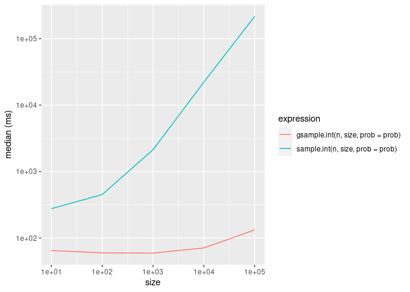

<!-- README.md is generated from README.Rmd. Please edit that file -->

# gsample

<!-- badges: start -->

<!-- badges: end -->

`gsample` allows efficient weighted sampling without replacement using
the Gumbel-Max trick.

## Installation

You can install `gsample` from
[GitHub](https://github.com/vgherard/gsample) with:

``` r
# install.packages("devtools")
devtools::install_github("vgherard/gsample")
```

## Example

The `gsample` API is identical to the one of `base::sample()`:

``` r
library(gsample)
n <- 1e3
size <- 1e2
prob <- exp(rnorm(n, sd = 3))
gsample.int(n, size, prob = prob)
#>   [1] 236   4 847 991 188 801 410 181 593 470 293 411 509 253 885 423  59 120
#>  [19] 880 301 894 883 784 768 546 955 778 529 899 307 629 176 131 468 206 865
#>  [37] 609 871 605 997  56 460 404 590 391 772 575 412 421 140 896 510  31 222
#>  [55] 437 488 755 258 480 875 160 982  54 399 713 731 432 543 734 505 388 380
#>  [73] 804 430  93 915 492 187 334 630 877 339 567 262 939 839 456 306 621 481
#>  [91] 197 716 382 597 859 727 745 365 162 159
```

``` r
x <- letters
size <- 10
prob <- exp(rnorm(length(letters), sd = 3))
gsample(x, size, prob = prob)
#>  [1] "g" "k" "w" "n" "y" "m" "u" "h" "t" "b"
```

Here are some simple benchmark comparisons with `base::sample()`:

``` r
library(dplyr)
library(ggplot2)
set.seed(840)
n <- 1e6
prob <- rexp(n)

bm <- lapply(10 ^ (1:5), function(size) {
    bench::mark(
        gsample.int(n, size, prob = prob),
        sample.int(n, size, prob = prob),
        check = FALSE
        ) %>%
        select(expression, median) %>%
        mutate(expression = as.character(expression)) %>%
            mutate(size = size)
    }) 

bind_rows(bm) %>%
    ggplot(aes(x = size, y = 1e3 * median, colour = expression)) +
        geom_line() +
        scale_x_continuous(trans = "log10") +
        scale_y_continuous("median (ms)", trans = "log10")
```


