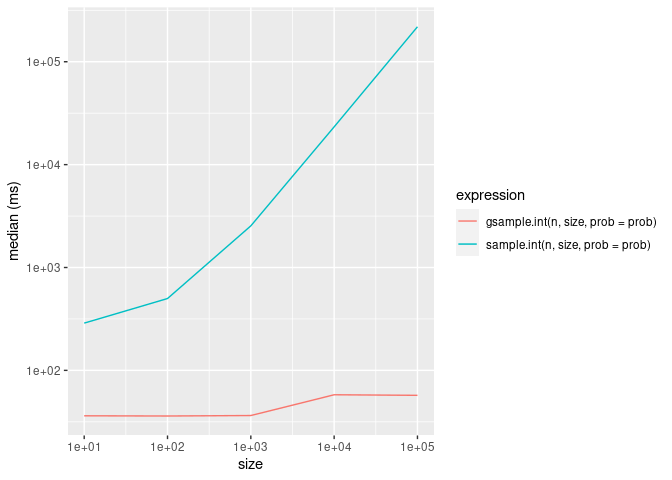

<!-- README.md is generated from README.Rmd. Please edit that file -->

# gsample

<!-- badges: start -->

<!-- badges: end -->

`gsample` allows efficient weighted sampling without replacement using
the Gumbel-Max trick.

## Installation

You can install `gsample` from
[GitHub](https://github.com/vgherard/gsample) with:

``` r
# install.packages("devtools")
devtools::install_github("vgherard/gsample")
```

## Example

The `gsample` API is identical to the one of `base::sample()`:

``` r
library(gsample)
n <- 1e3
size <- 1e2
prob <- exp(rnorm(n, sd = 3))
gsample.int(n, size, prob = prob)
#>   [1] 775 983 452  60 423 738  45 798 707 174 839 192 178 470 898 678 348 777
#>  [19]  37 362 267 569 720 367 614 460  26 598 954 405 892 841 142 970 976 424
#>  [37] 309 339 813 533 528 953 155 780  31 113 929 343 805 429 499 676 104  93
#>  [55] 582 493 211 984 889 463 504 808 264 670 552  57 855 333 712 683 941 746
#>  [73] 644 467 318 287  98 957 291 380 904 868 727 474 483 496  83 835 769  48
#>  [91] 556 469 512 480 886 748 665 409 326 755
```

``` r
x <- letters
size <- 10
prob <- exp(rnorm(length(letters), sd = 3))
gsample(x, size, prob = prob)
#>  [1] "g" "p" "u" "i" "b" "v" "c" "h" "y" "s"
```

Here are some simple benchmark comparisons with `base::sample()`:

``` r
library(dplyr)
library(ggplot2)
set.seed(840)
n <- 1e6
prob <- rexp(n)

bm <- lapply(10 ^ (1:5), function(size) {
    bench::mark(
        gsample.int(n, size, prob = prob),
        sample.int(n, size, prob = prob),
        check = FALSE
        ) %>%
        select(expression, median) %>%
        mutate(expression = as.character(expression)) %>%
            mutate(size = size)
    }) 

bind_rows(bm) %>%
    ggplot(aes(x = size, y = median, colour = expression)) +
        geom_line() +
        scale_x_continuous(trans = "log10") +
        scale_y_continuous("median (s)")
```


